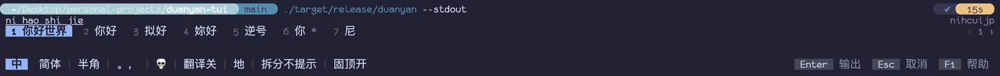

# 端砚 Duanyan

基于 [librime](https://github.com/rime/librime) 的终端中文输入法
APP。在没有系统输入法的环境里（SSH、TTY）用 rime
打字，提交后复制到剪贴板，或者作为选择器（类 fzf 的交互模式)把文字输出到
stdout。

inline 模式（`duanyan --stdout`），类似 fzf，在光标下方展开，提交后把文字输出到 stdout：



全屏模式（`duanyan`）：


## 安装

运行需要 librime ≥ 1.8 和 rime 方案数据（如 `rime-data`）。

### Nix

```sh
nix run github:milanglacier/duanyan-tui
nix profile install github:milanglacier/duanyan-tui
```

也可以把本仓库加为 flake input，使用 `inputs.duanyan.packages.${system}.default`。这样 librime 由 nix 提供；想连方案数据一起打包：

```nix
duanyan.override { rimeDataPackages = [ pkgs.rime-data ]; }
```

### 预编译二进制

[Releases](https://github.com/milanglacier/duanyan-tui/releases) 提供 Linux 与 macOS 的 x86_64 / aarch64 二进制，解压后把 `duanyan` 放进 `PATH` 即可。需要系统已安装 librime；Linux 版本要求 glibc ≥ 2.35。

### cargo

需要系统已安装 librime：

```sh
cargo install --git https://github.com/milanglacier/duanyan-tui duanyan
```

librime 与 rime 数据目录在运行时自动探测，`duanyan info` 可以查看实际解析到的位置。

### 从源码构建

```sh
nix build              # 推荐：自带工具链、librime 和 rime-data
cargo build --release  # 需要系统已安装 librime
```

## 使用

直接运行 `duanyan` 是全屏模式：上方输入框，下方历史面板。Enter 提交，文字记入历史并复制到剪贴板。

`--stdout` 则在光标下方打开一个几行的 inline 界面，提交一次即把文字写到 stdout 并退出，适合嵌进命令行：

```sh
git commit -m "$(duanyan --stdout)"
```

加 `--fullscreen` 可以仍用全屏界面，但输出到 stdout。

| 命令 | 说明 |
| --- | --- |
| `duanyan` | 全屏模式 |
| `duanyan --stdout` | 提交后把文字输出到 stdout |
| `duanyan deploy [--full]` | 部署 rime 配置，`--full` 强制重建 |
| `duanyan sync` | 同步用户词典 |
| `duanyan info` | 显示实际使用的 librime 与数据目录 |
| `duanyan --print-default-config` | 打印完整默认配置 |
| `duanyan --config <path>` | 使用指定的配置文件 |

首次运行会在 `~/.config/duanyan/rime` 初始化 rime 用户目录并自动部署，需要等待片刻。

## 配置

配置文件默认是 `~/.config/duanyan/config.toml`，不存在时全部使用默认值。用户配置会与默认配置逐项合并；键位按「动作」覆盖，把某个动作设为 `[]` 即可解绑。

完整默认值和注释见仓库里的 [`default_config.toml`](crates/duanyan/src/default_config.toml)，也可以运行 `duanyan --print-default-config` 查看。

| 配置组 | 作用 |
| --- | --- |
| `[general]` | 提交时是否复制到剪贴板 |
| `[rime]` | librime 路径、rime 数据目录、启动时部署策略 |
| `[tui]` | 键盘协议、鼠标、候选词排列 |
| `[theme]` | 深浅色与配色 |
| `[clipboard]` | 剪贴板后端 |
| `[history]` | 是否持久化历史、条数上限 |
| `[keybinding.*]` | 键位绑定 |

几个例子：

```toml
[rime]
deploy_on_startup = "auto"   # notify | auto | never

[theme]
mode = "dark"                # auto | dark | light

[clipboard]
# backend = "command"          # 推荐不填（默认 OSC 52，自动处理）
# command = ["wl-copy"]
```

## 按键

所有按键先交给 rime，rime 没有处理的才由端砚处理，因此方案自带的翻页、方案选单等键位照常可用。完整键位见 `default_config.toml` 和 F1 帮助页。

| 键 | 作用 |
| --- | --- |
| Enter | 提交（rime 未组字时） |
| Ctrl+J | 换行 |
| Ctrl+P / Ctrl+N | 上一行 / 下一行（组字时交给 rime 移动候选） |
| Tab | 切到历史面板（未组字时） |
| 历史面板：j/k、y、Enter、d | 移动、复制、取回编辑、删除 |
| F1 / F5 / F6 / Ctrl+C | 帮助 / 部署 / 同步 / 退出 |

多数终端无法单独发送 Shift 键，默认把 `alt+l` / `alt+r` 映射为左 / 右 Shift，用来切换中英文；支持 kitty 键盘协议的终端可以直接按 Shift。键位写法为 `[ctrl+][alt+][super+][shift+]<key>`。

## 目录

| 用途 | 默认位置 |
| --- | --- |
| 配置文件 | `~/.config/duanyan/config.toml` |
| rime 用户目录 | `~/.config/duanyan/rime` |
| rime 共享目录 | 自动探测（`/usr/share/rime-data` 等） |
| 历史、日志、实例锁 | `~/.local/state/duanyan/` |

共享目录对 rime 只读，可以与 fcitx5 等其它前端共用；用户目录必须独立。找不到共享目录时，把整套方案放进 `~/.config/duanyan/rime` 即可。

## 剪贴板

默认通过 OSC 52 复制，SSH 下同样可用；tmux 里需要 `set -g set-clipboard on`。也可以改用外部命令：

```toml
[clipboard]
# backend = "command"
# command = ["wl-copy"]
```

建议 `backend` 和 `command` 都不要填写：端砚会自动处理，不配置时默认使用 OSC
52，SSH 下同样可用。只有确实需要外部命令时才写 `backend = "command"`；此时
`command` 仍建议留空，端砚会按当前会话自动探测可用的工具（Wayland 用
`wl-copy`，X11 用 `xclip` / `xsel`，macOS 用
`pbcopy`），探测不到或想指定工具时才手填。

## 多实例

同一时间只有一个端砚能打开用户词典。已有端砚在运行时，新实例照常出候选，但不学习新词，也不能部署或同步。

## 许可证

[GPL-3.0-or-later](LICENSE)
