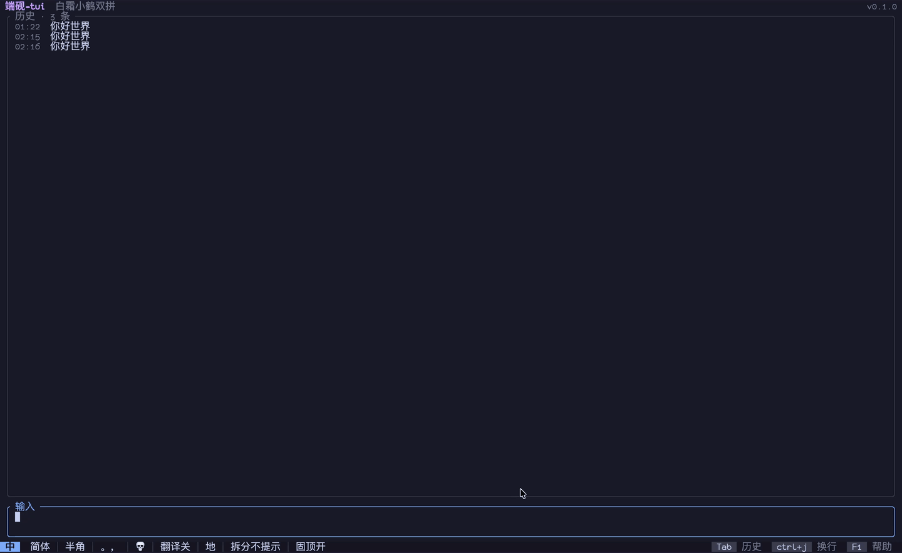

# 端砚 Duanyan

基于 [librime](https://github.com/rime/librime) 的终端中文输入法
APP。在没有系统输入法的环境里（SSH、TTY）用 rime 打字，有四种用法：

- 直接运行 `duanyan`，输入完后回车，文字自动复制到剪贴板；
- 在 shell prompt 里直接当输入法用：输入 `^^` 再按 Tab 上屏（类似 fzf 的 `**<Tab>`）；
- 把 `duanyan` 设为 `EDITOR`，coding agent 里用 `ctrl+g` 打开编辑器直接输入中文；
- 用 `duanyan --stdout` 作为选择器（类 fzf 的交互模式），提交后把文字输出到 stdout。

inline 模式 + shell 集成：


全屏模式（`duanyan`）：



## 安装

运行需要 librime ≥ 1.8 和 rime 方案数据（如 `rime-data`）。Releases 里的 bundled 包自带 librime，见[预编译二进制](#预编译二进制)。

librime 和 rime 共享数据目录会自动探测，也可以在 `~/.config/duanyan/config.toml` 里手动指定：

```toml
[rime]
librime_path = "/path/to/librime.so.1"     # macOS 上是 librime.1.dylib
shared_data_dir = "/path/to/rime-data"
```

也可以用环境变量 `DUANYAN_LIBRIME_PATH` / `DUANYAN_RIME_SHARED_DIR` 指定，配置文件优先。`duanyan info` 可以查看实际使用的位置。

### Nix

```sh
nix run github:milanglacier/duanyan-tui
nix profile install github:milanglacier/duanyan-tui
```

也可以把本仓库加为 flake input，使用 `inputs.duanyan.packages.${system}.default`。这样 librime 由 nix 提供；想连方案数据一起打包：

```nix
duanyan.override { rimeDataPackages = [ pkgs.rime-data ]; }
```

### 预编译二进制

[Releases](https://github.com/milanglacier/duanyan-tui/releases) 提供 Linux 与 macOS 的 x86_64 / aarch64 二进制，Linux 版本要求 glibc ≥ 2.35。每个平台有两种包，以 x86_64 Linux 为例：

| 包 | 内容 |
| --- | --- |
| `duanyan-${VERSION}-x86_64-unknown-linux-gnu-bundled.tar.gz` | 二进制 + librime 1.17.0（含 lua、octagram、predict 插件），不需要另装 librime |
| `duanyan-${VERSION}-x86_64-unknown-linux-gnu.tar.gz` | 只有二进制，需要系统已安装 librime |

文件名由 `duanyan-${VERSION}-${TARGET}` 构成：`VERSION` 是 release tag（如
`v0.1.3`），发布新版本后请替换为 Releases 上的最新版；`TARGET` 按平台替换即可。

bundled 包解压后应保持目录结构，端砚会使用自身旁边 `lib/` 里的 librime。把 `duanyan` symlink 进 `PATH` 即可：

```sh
VERSION=v0.1.3  # 替换成 Releases 上的最新版本
curl -L -O https://github.com/milanglacier/duanyan-tui/releases/download/${VERSION}/duanyan-${VERSION}-x86_64-unknown-linux-gnu-bundled.tar.gz
tar -xzf duanyan-${VERSION}-x86_64-unknown-linux-gnu-bundled.tar.gz -C ~/.local/share
ln -s ~/.local/share/duanyan-${VERSION}-x86_64-unknown-linux-gnu-bundled/duanyan ~/.local/bin/duanyan
rm duanyan-${VERSION}-x86_64-unknown-linux-gnu-bundled.tar.gz
```

也可以把 `duanyan` 放进 `~/.local/bin`，把 `lib/`、`share/` 里的文件分别放进 `~/.local/lib`、`~/.local/share`。

bundled 包不包含输入方案数据。想开箱即用、零配置的用户，建议直接使用
[rime-ice](https://github.com/iDvel/rime-ice) 或
[rime-frost](https://github.com/gaboolic/rime-frost)。将所选仓库的内容直接放到
`~/.config/duanyan/rime`，再运行 `duanyan`，首次启动时会自动部署：

```sh
git clone --depth 1 https://github.com/iDvel/rime-ice ~/.config/duanyan/rime
```

### cargo

需要系统已安装 librime：

```sh
cargo install --git https://github.com/milanglacier/duanyan-tui duanyan
```

### 从源码构建

```sh
nix build              # 推荐：自带工具链、librime 和 rime-data
cargo build --release  # 需要系统已安装 librime
```

## 使用

直接运行 `duanyan` 是全屏模式：上方输入框，下方历史面板。Enter 提交，文字记入历史并复制到剪贴板。

`--stdout` 则在光标下方打开一个几行的 inline 界面，提交一次即把文字写到 stdout 并退出，适合嵌进命令行：

```sh
git commit -m "$(duanyan --stdout)"
```

加 `--fullscreen` 可以仍用全屏界面，但输出到 stdout。

### 作为编辑器

`duanyan <文件>` 打开文件编辑，可以设为 `EDITOR`，在 `git commit` 或 coding agent 打开编辑器让你输入的场景里直接用 rime 输入中文。

```sh
export EDITOR=duanyan    # 或 git config --global core.editor duanyan
```

Enter 保存并退出，Ctrl+J 换行；Esc 放弃修改并以非零退出码退出（文件改过时需要再按一次），git 会据此中止提交。

| 命令 | 说明 |
| --- | --- |
| `duanyan` | 全屏模式 |
| `duanyan --stdout` | 提交后把文字输出到 stdout |
| `duanyan <文件>` | 编辑文件，Enter 保存，可作为 `EDITOR` |
| `duanyan deploy [--full]` | 部署 rime 配置，`--full` 强制重建 |
| `duanyan sync` | 同步用户词典 |
| `duanyan info` | 显示实际使用的 librime 与数据目录 |
| `duanyan init <zsh\|bash\|fish>` | 输出 shell 集成脚本 |
| `duanyan --print-default-config` | 打印完整默认配置 |
| `duanyan --config <path>` | 使用指定的配置文件 |

首次运行会在 `~/.config/duanyan/rime` 初始化 rime 用户目录并自动部署，需要等待片刻。

### Shell 集成

类似 fzf 的 `**<Tab>`：在命令行里输入 `^^` 再按 Tab，就地打开 inline 界面，提交的文字替换掉 `^^`。

```sh
eval "$(duanyan init zsh)"    # ~/.zshrc
duanyan init fish | source    # ~/.config/fish/config.fish
```

触发串可以用 `DUANYAN_TRIGGER` 修改。bash 不接管 Tab，需要自己绑定一个键：

```bash
eval "$(duanyan init bash)"
bind -x '"\C-x\C-d": __duanyan_widget'
```

## 配置

配置文件默认是 `~/.config/duanyan/config.toml`，不存在时全部使用默认值。用户配置会与默认配置逐项合并；键位按「动作」覆盖，把某个动作设为 `[]` 即可解绑。

完整默认值和注释见仓库里的 [`default_config.toml`](crates/duanyan/src/default_config.toml)，也可以运行 `duanyan --print-default-config` 查看。

| 配置组 | 作用 |
| --- | --- |
| `[general]` | 提交时是否复制到剪贴板 |
| `[rime]` | librime 路径、rime 数据目录、启动时部署策略 |
| `[tui]` | 键盘协议、鼠标、候选词排列、界面简繁 |
| `[theme]` | 深浅色与配色 |
| `[clipboard]` | 剪贴板后端 |
| `[history]` | 是否持久化历史、条数上限 |
| `[keybinding.*]` | 键位绑定 |

几个例子：

```toml
[rime]
deploy_on_startup = "auto"   # notify | auto | never

[tui]
language = "auto"     # auto | simplified | traditional

[theme]
mode = "dark"                # auto | dark | light

[clipboard]
# backend = "command"          # 推荐不填（默认 OSC 52，自动处理）
# command = ["wl-copy"]
```

## 按键

所有按键先交给 rime，rime 没有处理的才由端砚处理，因此方案自带的翻页、方案选单等键位照常可用。完整键位见 `default_config.toml` 和 F1 帮助页。

| 键 | 作用 |
| --- | --- |
| Enter | 提交（rime 未组字时） |
| Ctrl+J | 换行 |
| Ctrl+P / Ctrl+N | 上一行 / 下一行（组字时交给 rime 移动候选） |
| Alt+B / Alt+F | 前一词 / 后一词 |
| Alt+< / Alt+> | 文本开头 / 结尾 |
| Ctrl+Z、Ctrl+/、Ctrl+_ | Undo |
| Ctrl+Y、Alt+_ | Redo |
| Tab | 切到历史面板（未组字时） |
| 历史面板：j/k、y、Enter、d | 移动、复制、取回编辑、删除 |
| F1 / F5 / F6 / Ctrl+C | 帮助 / 部署 / 同步 / 退出 |

多数终端无法单独发送 Shift 键，默认把 `ctrl+l` / `ctrl+r` 映射为左 / 右 Shift，用来切换中英文；支持 kitty 键盘协议的终端可以直接按 Shift。键位写法为 `[ctrl+][alt+][super+][shift+]<key>`。

<details>
<summary>终端与 rime 的按键处理差异</summary>

支持 kitty 键盘协议的终端会单独报告 Ctrl、Alt 等修饰键。rime 只在最先按下的修饰键是 Shift 时，才把 Shift 的敲击当作切换中英文。如果把 Ctrl 也发给 rime，按 `ctrl+l` 时 rime 会先看到 Ctrl，模拟的 Shift 就不起作用了。

因此端砚只把单独的 Shift 发给 rime。代价是 rime 配置里 `ascii_composer/switch_key` 的 `Control_L` / `Control_R` 不会生效（默认都是 `noop`）。如果你习惯用 Ctrl 切换中英文，可以改用 Shift：

```yaml
# ~/.config/duanyan/rime/default.custom.yaml
patch:
  ascii_composer/switch_key/Shift_L: commit_code
```

或者在端砚里绑一个键来模拟 Ctrl 敲击：

```toml
[keybinding.compat]
Control_L = "f9"
```

</details>

全屏模式下，点击输入框里的文字可以移动光标；拖动选中文字，松开即复制到剪贴板，选中后按 Backspace 删除选中的文字。

## 目录

| 用途 | 默认位置 |
| --- | --- |
| 配置文件 | `~/.config/duanyan/config.toml` |
| rime 用户目录 | `~/.config/duanyan/rime` |
| librime | 自动探测（bundled 包优先用自带的 `lib/`），或 `[rime] librime_path` |
| rime 共享目录 | 自动探测（`/usr/share/rime-data` 等），或 `[rime] shared_data_dir` |
| 历史、日志、实例锁 | `~/.local/state/duanyan/` |

共享目录对 rime 只读，可以与 fcitx5 等其它前端共用；用户目录必须独立。找不到共享目录时，把整套方案放进 `~/.config/duanyan/rime` 即可。

## 剪贴板

默认通过 OSC 52 复制，SSH 下同样可用；tmux 里需要 `set -g set-clipboard on`。也可以改用外部命令：

```toml
[clipboard]
# backend = "command"
# command = ["wl-copy"]
```

建议 `backend` 和 `command` 都不要填写：端砚会自动处理，不配置时默认使用 OSC
52，SSH 下同样可用。只有确实需要外部命令时才写 `backend = "command"`；此时
`command` 仍建议留空，端砚会按当前会话自动探测可用的工具（Wayland 用
`wl-copy`，X11 用 `xclip` / `xsel`，macOS 用
`pbcopy`），探测不到或想指定工具时才手填。

## 多实例

同一时间只有一个端砚能打开用户词典。已有端砚在运行时，新实例照常出候选，但不学习新词，也不能部署或同步。

## 许可证

[GPL-3.0-or-later](LICENSE)
